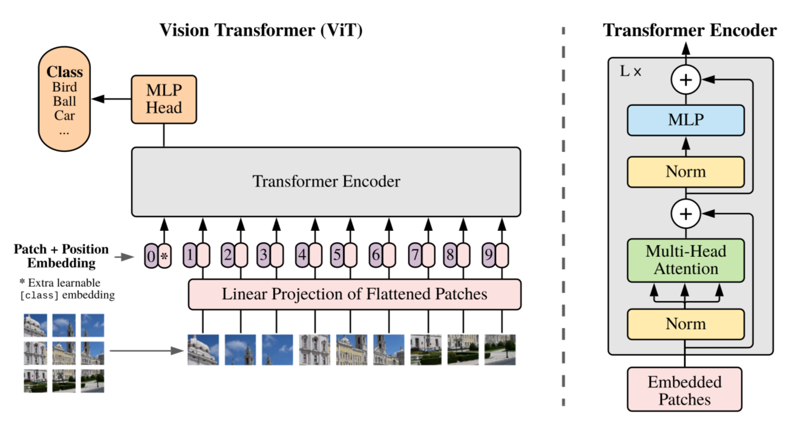
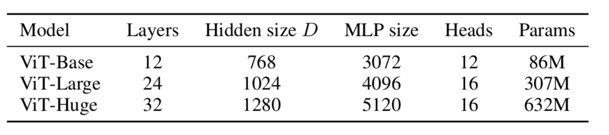

## Vision Transformer Implementation

This repository contains an implementation of the Vision Transformer (ViT) as described in the paper **An Image is Worth 16x16 Words: Transformers for Image Recognition at Scale**. 

Read the full paper [here](https://arxiv.org/pdf/2010.11929.pdf).

### Project Overview

This project implements a transformer-based model as an alternative to convolutional neural networks (CNNs) for image classification tasks.

### Architecture

The architecture is based on the Vision Transformer (ViT) model, where input images are divided into 16x16 pixel patches. Each patch is flattened, linearly projected, and augmented with trainable class and positional embeddings before being processed by a Transformer Encoder composed of multiple blocks. Each block includes:

- Layer Normalization
- Multi-Head Attention
- Layer Normalization
- Multi-Layer Perceptron (MLP)

Residual connections facilitate gradient flow, and the output is classified via an adjustable MLP Head.

### Implementation

The model interface is implemented using PyTorch classes. The classes such as `Attention` (for multi-head attention) and `TransformerEncoderBlock` are implemented according to the formulas in the referenced paper. Some implementation details, not covered in the paper, were inspired by the [official implementation](https://github.com/google-research/vision_transformer/blob/master/vit_jax/models.py) from the authors, including how positional embeddings are initialized.

The training script is available in a notebook and is easily reproducible. The logs for training and validation losses, as well as metrics, are available for review [here](https://app.neptune.ai/calistro/vit/experiments?viewId=standard-view).

### Training and Experiments

The original model was trained on the extensive private JFT-300M dataset, which took thousands of TPUv3-core days to process. Due to resource limitations, model parameters and dataset size were adjusted accordingly for this implementation.

In the paper, the authors compare several variants of ViT with different configurations: ViT-Base, ViT-Large, and ViT-Huge.

Experiments utilized the ViT-Base model with reduced parameters (Layers, Hidden size, MLP size, Heads) by 2/3, training from scratch on the `TinyImageNet` dataset, which comprises 200 classes with 500 images of size 64x64 pixels each.

Several experiments were conducted to evaluate the model:

- **Initial Experiments**: Parameters were set as per the original paper with `weight_decay=0.03` and `dropout=0.1`, resulting in an accuracy of less than 6% due to excessive regularization.

- **Optimizer Improvement**: A learning rate scheduler was introduced, and `weight_decay` was reduced to `0.001`, leading to an accuracy of 0.25 on validation after 100 epochs.

- **Patch Size Adjustment**: The patch size was reduced to 8x8 to accommodate TinyImageNet’s resolution of 64x64 pixels. Weight decay was eliminated, `dropout` was set to 0.05, and the hyperparameter values of the ViT-Base configuration were reduced. This configuration achieved the best results, reaching an accuracy of 0.38 on validation after 150 epochs, although the model exhibited early signs of overfitting. 

Overall, these experiments demonstrate the potential of transformer-based models in image classification tasks compared to traditional CNNs.

### Summary of Experiments
| Experiment        | Patch Size | Layers | Hidden size | MLP size | Heads | Weight Decay | Dropout | Validation Accuracy |
|-------------------|------------|--------|-------------|----------|-------|--------------|---------|---------------------|
| Initial           | 16x16      | 8      | 512         | 2048     | 8     |0.03         | 0.1     | <6%                 |
| Experiment VIT-10 | 16x16      | 8      | 512         | 2048     | 8     |0.001        | 0.1     | 0.25                |
| Experiment VIT-12 | 8x8        | 6      | 384         | 1536     | 6     |0            | 0.05    | 0.38                |

Thus, the functioning implementation of the method has been tested. Further training on other datasets will require parameter fine-tuning.
